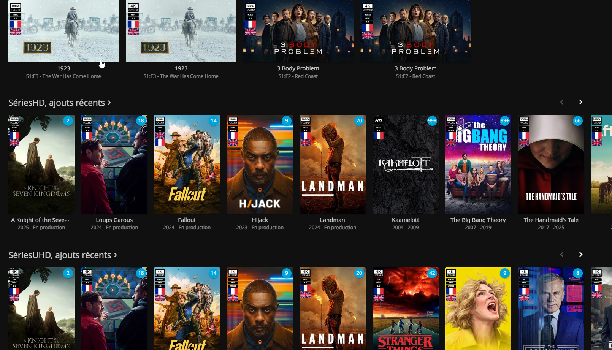
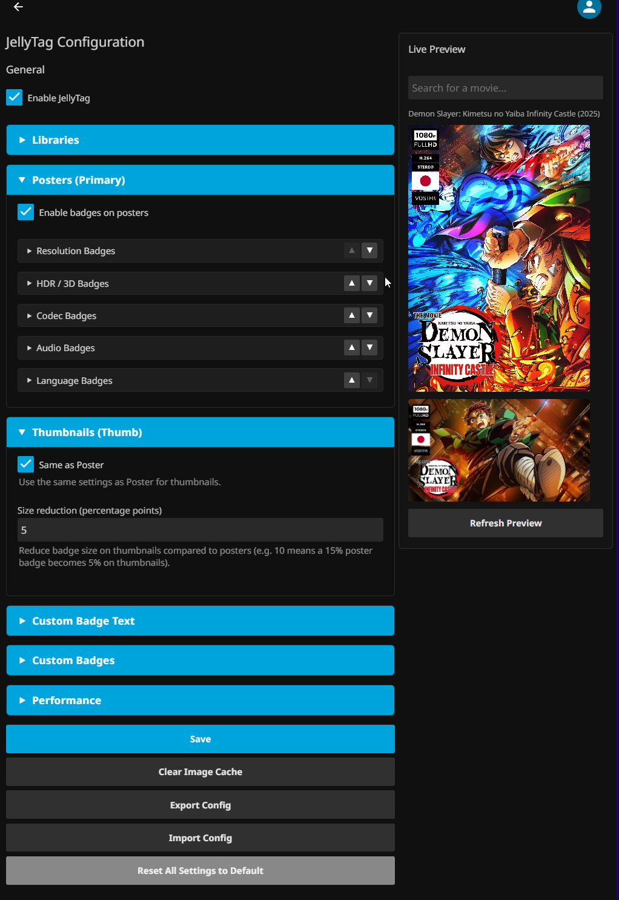

# JellyTag — Quality Badge Plugin for Jellyfin

JellyTag automatically overlays quality badges (resolution, HDR, codec, audio, language) on your media posters and thumbnails. Badges are rendered server-side via HTTP middleware, so they appear on **all Jellyfin clients** without any configuration.

<p align="center">
    
</p>

## Features

- **Multi-category badges**: Resolution, HDR, Video Codec, Audio, Language flags, and VOST indicator
- **Universal client support**: Server-side rendering via HTTP middleware — works on all Jellyfin clients
- **Per-image-type configuration**: Independent settings for posters and thumbnails (position, size, layout, style)
- **Per-panel customization**: Each badge category has its own panel with position, layout, ordering, colors, and display mode (highest only or all)
- **SVG & text badge styles**: Choose between SVG image badges or text-based badges with customizable colors, opacity, and corner radius
- **Custom badges**: Replace any default badge with your own SVG/PNG/JPEG, or customize text labels — via the config UI or API
- **Live preview**: See badge changes in real-time directly in the configuration page
- **Library filtering**: Exclude specific libraries from badge generation
- **Config export/import**: Backup and restore your configuration as JSON
- **File-based caching**: Processed images are cached to disk with automatic expiration

## Screenshots




## Installation

1. In Jellyfin, go to **Dashboard** → **Plugins** → **Repositories**
2. Add a new repository with this URL:
   ```
   https://raw.githubusercontent.com/Atilil/jellyfin-plugins/main/manifest.json
   ```
3. Go to **Catalog**, find **JellyTag** and install it
4. Restart Jellyfin

## Configuration

Go to **Dashboard** → **Plugins** → **JellyTag** to access the configuration page.

### Global Settings

| Option | Description | Default |
|--------|-------------|--------|
| Enable JellyTag | Enable/disable the plugin globally | Enabled |
| Output Format | JPEG or WebP | JPEG |
| JPEG Quality | Output image quality (50-100) | 90 |
| Cache Duration | How long cached images are kept (hours) | 24 |
| Excluded Libraries | Libraries to skip for badge generation | None |

### Image Type Settings (Poster / Thumbnail)

Each image type has independent panel settings. Thumbnails can optionally mirror poster settings with a size reduction.

Each badge category (Resolution, HDR, Codec, Audio, Language) is configured as a **panel** with:

| Setting | Description |
|---------|-------------|
| Enabled | Show/hide this category |
| Position | Corner placement (TopLeft, TopRight, BottomLeft, BottomRight) |
| Layout | Horizontal or Vertical stacking |
| Style | Image (SVG) or Text badges |
| Size % | Badge width as percentage of image |
| Margin % | Distance from edge |
| Gap % | Spacing between badges |
| Display Mode | Show highest quality only, or all |
| Order | Panel stacking order |
| Text colors | Background color, text color, opacity, corner radius |

## Custom Badges

You can replace any default badge with your own image or customize the text label for text-style badges.

- **Via the config UI**: Use the Custom Badges section to upload SVG, PNG, or JPEG files, and set custom text per badge
- **Via the API**: `POST /JellyTag/CustomBadge/{badgeKey}` to upload, `DELETE` to revert to default

Custom badges are stored in the plugin data folder and survive updates.

## How It Works

JellyTag intercepts Jellyfin image requests via HTTP middleware, detects media quality from metadata, composites badges onto images using SkiaSharp, and caches the results to disk. No reverse proxy or client-side configuration needed.

## Requirements

- Jellyfin 10.11.x or later
- .NET 9.0 runtime (included with Jellyfin 10.11+)

## Troubleshooting

- **Badges not appearing**: Verify the plugin is enabled, check that badge categories are enabled, clear browser cache and plugin image cache
- **Clearing the cache**: Use the "Clear Image Cache" button in the config page
- **Performance**: Increase cache duration, lower JPEG quality, disable unneeded badge categories

## License

MIT License
